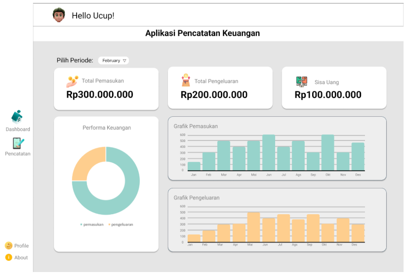

# MyFinance – Personal Finance Management Application

## Overview

**MyFinance** adalah aplikasi desktop berbasis Python yang dirancang untuk membantu pengguna mencatat, memantau, dan menganalisis keuangan pribadi secara terstruktur. Aplikasi ini mengintegrasikan antarmuka grafis (GUI) dengan sistem manajemen basis data SQL untuk memastikan pencatatan transaksi yang efisien, terorganisir, dan mudah diakses.

---

## Objectives

* Menyediakan sistem pencatatan pemasukan dan pengeluaran yang sistematis
* Memvisualisasikan data keuangan dalam bentuk grafik
* Membantu pengguna memahami pola finansial untuk pengambilan keputusan yang lebih baik

---

## System Architecture

MyFinance dibangun menggunakan pendekatan modular:

* **Frontend (GUI):** Python Tkinter
* **Backend Logic:** Python
* **Database:** SQL (SQLite/MySQL)
* **Data Visualization:** Matplotlib

Arsitektur ini memungkinkan integrasi antara input pengguna, penyimpanan data terstruktur, dan visualisasi laporan dalam satu aplikasi desktop yang ringan.

---

## Data Management

* Penyimpanan transaksi menggunakan database relasional
* Setiap transaksi memiliki atribut: tanggal, jenis (income/expense), kategori, dan nominal
* Query SQL digunakan untuk agregasi data dalam pembuatan laporan

---

## Technology Stack

* Python
* Tkinter (GUI)
* SQL Database (MySQL)
* Matplotlib (visualisasi grafik)
